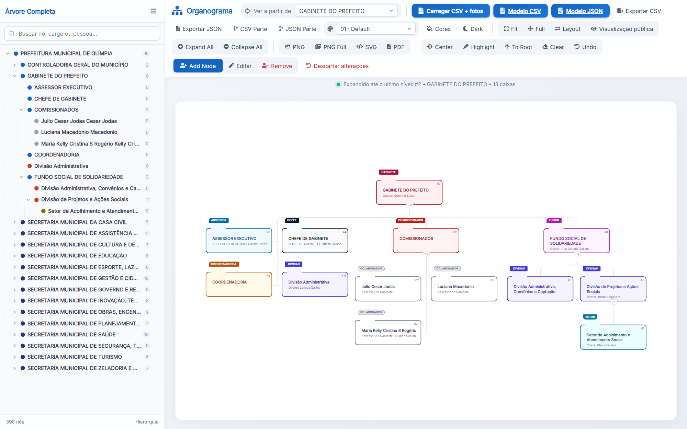
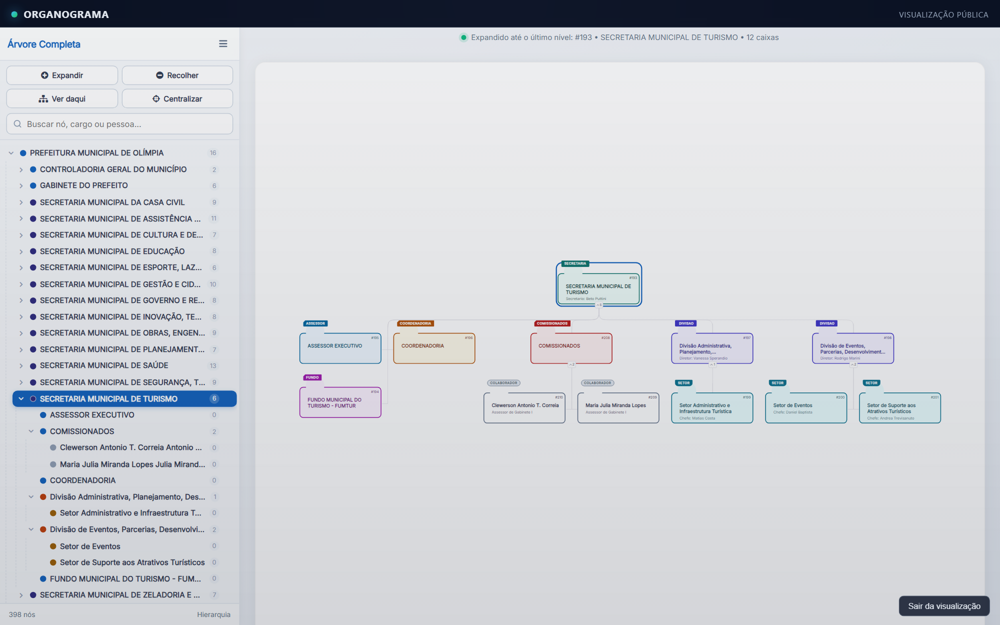
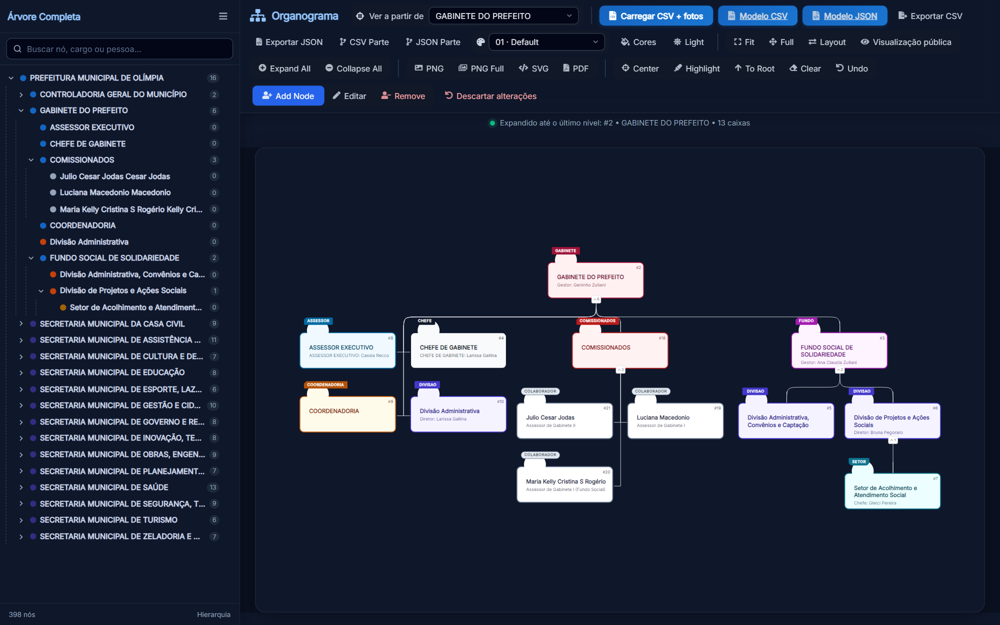
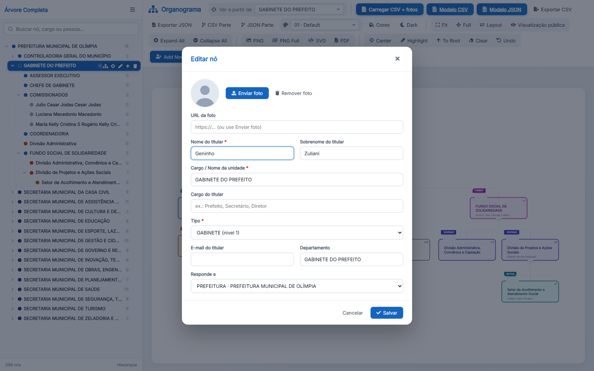
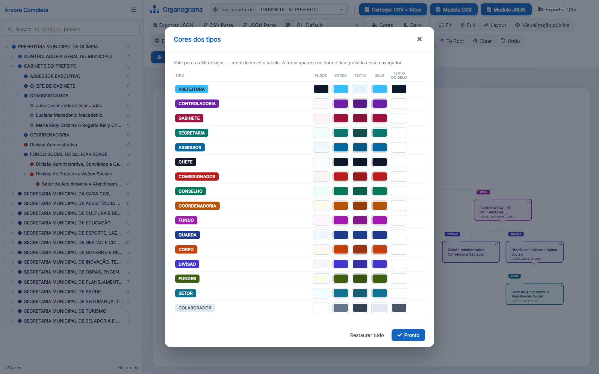
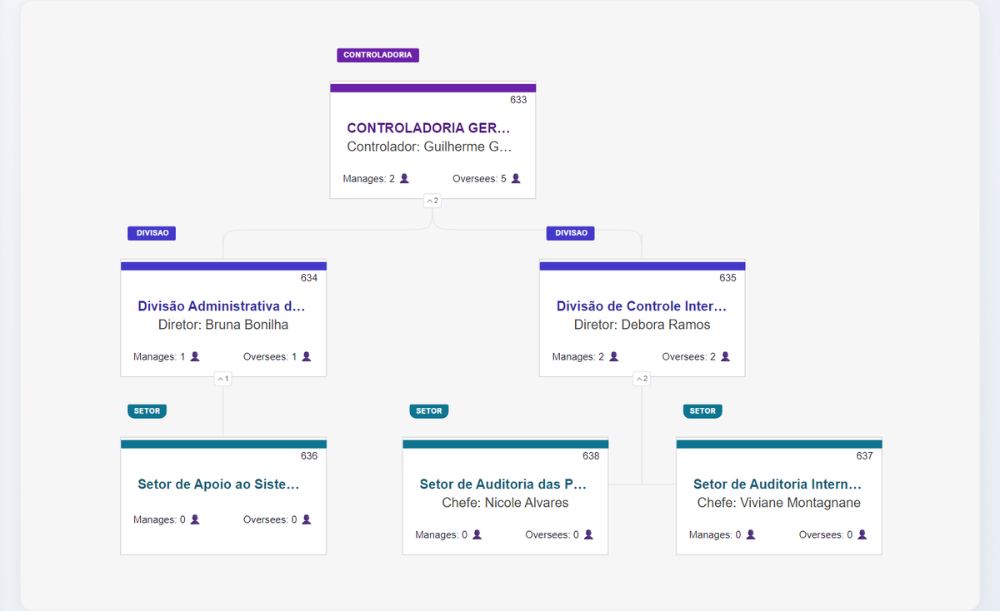
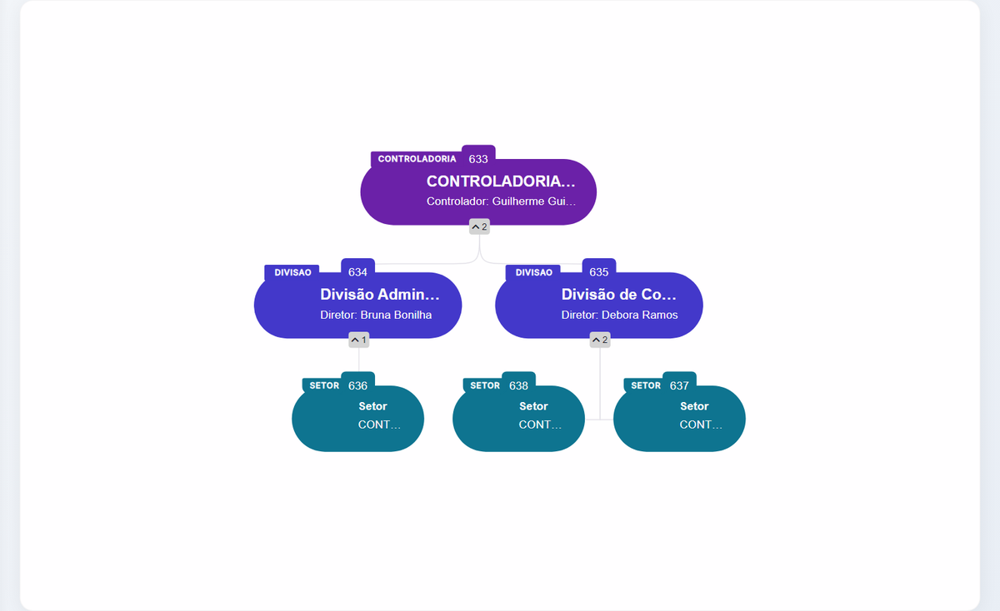
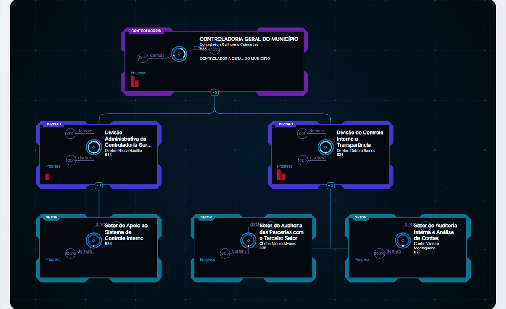
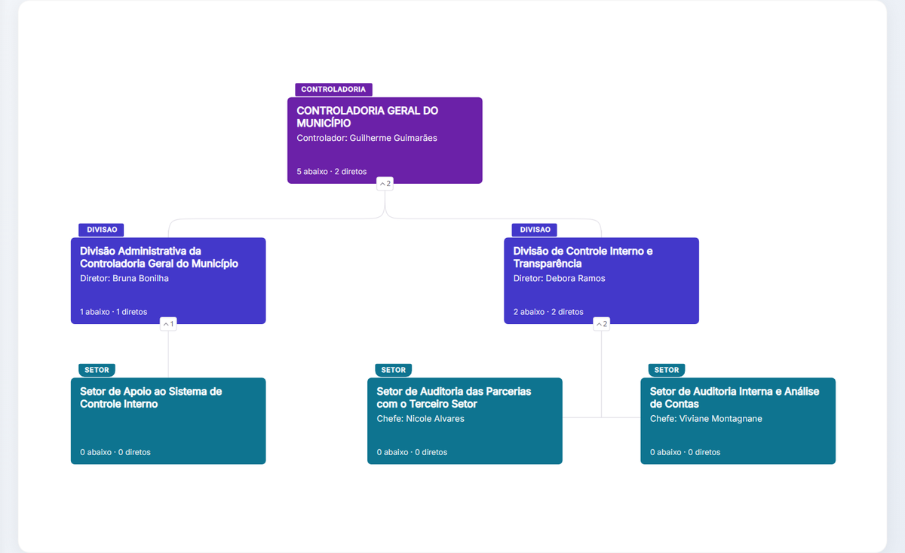

<div align="center">

# Organograma Municipal

Aplicacao web para visualizar, editar, importar e exportar o organograma institucional da Prefeitura de Olimpia.

[](https://nodejs.org)
[](https://developer.mozilla.org/docs/Web/JavaScript)
[](https://d3js.org)
[](https://github.com/bumbeishvili/org-chart)
<br>
[](https://docs.docker.com/compose/)
[](https://learn.microsoft.com/windows/wsl/)
[](server.js)
[](#)
[](https://github.com/josegoncalves2/repo-organograma/commits/main)

<br>

<picture>
  <source media="(prefers-color-scheme: dark)" srcset="docs/screenshots/organograma-escuro.png">
  
</picture>

</div>

O projeto roda em Docker via WSL, usando Node.js puro no servidor e uma pagina HTML/JS no navegador. Os dados editados ficam persistidos em volume Docker.

## Telas

### Visualizacao publica

Tela somente leitura em `/view/`, para exibir o organograma sem risco de edicao. As acoes ficam juntas acima da busca da arvore e agem no item selecionado: expandir ate o ultimo nivel, recolher, ver o organograma a partir dele e centralizar.



### Modo claro e modo escuro

<table>
  <tr>
    <td width="50%"></td>
    <td width="50%"></td>
  </tr>
</table>

### Edicao de cards e cores por tipo

<table>
  <tr>
    <td width="50%"></td>
    <td width="50%"></td>
  </tr>
  <tr>
    <td align="center">Duplo clique no card abre o editor</td>
    <td align="center">Cores de cada tipo, validas para todos os designs</td>
  </tr>
</table>

### Designs

O mesmo organograma (Controladoria Geral do Municipio) em alguns dos designs do seletor.

<table>
  <tr>
    <td width="50%"></td>
    <td width="50%"></td>
  </tr>
  <tr>
    <td align="center">Sky</td>
    <td align="center">Oval</td>
  </tr>
  <tr>
    <td width="50%"></td>
    <td width="50%"></td>
  </tr>
  <tr>
    <td align="center">Futuristic</td>
    <td align="center">Prev version</td>
  </tr>
</table>

## Acesso

Na maquina atual, o servico esta configurado para WSL com rede espelhada e porta `8085`:

```text
http://192.168.0.218:8085
```

Localmente tambem funciona em:

```text
http://localhost:8085
```

## Subir pelo WSL

```bash
cd /mnt/c/Users/40446686808/projetos/organograma
docker compose up -d --build
docker compose ps
```

Teste de saude:

```bash
curl -fsS http://192.168.0.218:8085/api/saude
```

Resposta esperada:

```json
{"ok":true}
```

## Funcionalidades

- Visualizacao do organograma completo ou a partir de um ramo.
- Sidebar/Tree View hierarquica, redimensionavel e responsiva.
- Modo claro/escuro.
- Seletor de escopo com rotulos repetidos desambiguados pelo orgao ancestral.
- Edicao de card por duplo clique.
- Criacao, edicao e remocao de cards pela toolbar e pela sidebar.
- Upload individual e em lote de fotos.
- Campo de e-mail e foto por card.
- Exportacao completa ou parcial em CSV e JSON.
- Exportacao visual em PNG, PNG completo, SVG e PDF.
- Modelos de importacao em CSV e JSON.
- Persistencia automatica no servidor.

## Regras de modelagem

Unidade institucional e colaborador nao sao a mesma coisa.

- `SECRETARIA`, `CONTROLADORIA`, `GABINETE`, `DIVISAO`, `SETOR`, `COORDENADORIA`, `ASSESSOR`, `FUNDO`, `CHEFE`, `CONSELHO`, `GUARDA`, `CORPO`, `FUNDEB` e `COMISSIONADOS` sao unidades ou grupos institucionais.
- `COLABORADOR` e pessoa.
- O gestor direto de uma unidade aparece dentro do card da unidade quando a regra identifica que ele ocupa aquela unidade.
- Pessoas de `COMISSIONADOS` continuam como cards separados, pois ali sao lista/grupo de colaboradores.

## Dados

Arquivo persistente em runtime:

```text
/dados/organograma.json
```

Arquivo inicial embutido na imagem:

```text
dados/organograma.json
```

Colunas/campos:

```text
id,parentId,name,lastName,position,type,email,department_name,location_state,image
```

Modelos de importacao:

```text
misc/modelo-organograma.csv
misc/modelo-organograma.json
```

## Documentacao

- [Arquitetura](docs/ARQUITETURA.md)
- [Operacao com Docker e WSL](docs/OPERACAO-WSL.md)
- [Dados, tipos e gestores](docs/DADOS-E-HIERARQUIA.md)
- [Interface e fluxos de uso](docs/INTERFACE.md)
- [Importacao e exportacao](docs/IMPORTACAO-EXPORTACAO.md)
- [Troubleshooting](docs/TROUBLESHOOTING.md)

## Estrutura principal

```text
tree.html                 Interface principal
server.js                 Servidor HTTP e API de persistencia
docker-compose.yml        Compose para WSL host network na porta 8085
Dockerfile                Imagem Node.js
dados/organograma.json    Dados iniciais
misc/                     CSVs, modelos, favicon e materiais auxiliares
sidebar/                  Tree View em iframe
build/                    CSS e bibliotecas JS vendorizadas
src/                      Fonte da lib d3-org-chart
scripts/                  Scripts auxiliares
docs/                     Documentacao do projeto
```

## Comandos uteis

```bash
# Rebuild e subida
docker compose up -d --build

# Ver estado
docker compose ps

# Logs
docker compose logs --tail=100 orgchart

# Derrubar
docker compose down
```

