# 🏛️ Organograma Municipal — Prefeitura de Olímpia

> **Visualização institucional completa** da Prefeitura Municipal de Olímpia, com 15 Secretarias, Gabinete do Prefeito, Controladoria Geral, Divisões, Setores e Colaboradores — renderizado diretamente no navegador via Docker.

<p align="center">
  
  
  
  
  
</p>

<p align="center">
  
</p>

---

## 📊 Estrutura do Organograma

```mermaid
graph TD
    A[PREFEITURA MUNICIPAL DE OLÍMPIA] --> B[GABINETE DO PREFEITO]
    A --> C[SECRETARIA DA CASA CIVIL]
    A --> D[SECRETARIA DE GOVERNO]
    A --> E[SECRETARIA DE ASSISTÊNCIA SOCIAL]
    A --> F[SECRETARIA DE ESPORTE]
    A --> G[SECRETARIA DE TURISMO]
    A --> H[SECRETARIA DE CULTURA]
    A --> I[SECRETARIA DE INOVAÇÃO]
    A --> J[SECRETARIA DE SAÚDE]
    A --> K[SECRETARIA DE EDUCAÇÃO]
    A --> L[SECRETARIA DE PLANEJAMENTO]
    A --> M[SECRETARIA DE GESTÃO]
    A --> N[SECRETARIA DE OBRAS]
    A --> O[SECRETARIA DE ZELADORIA]
    A --> P[SECRETARIA DE SEGURANÇA]
    A --> Q[CONTROLADORIA GERAL]
    B --> B1[FUNDO SOCIAL]
    B --> B2[CHEFE DE GABINETE]
    B --> B3[ASSESSOR EXECUTIVO]
    B --> B4[COORDENADORIA]
    B --> B5[COMISSIONADOS]
    C --> C1[ASSESSOR EXECUTIVO]
    C --> C2[COORDENADORIA]
    C --> C3[DIVISÃO DE PLANEJAMENTO]
    C --> C4[DIVISÃO DE ANÁLISE DE DADOS]
    C --> C5[DIVISÃO DE GOVERNANÇA]
    C --> C6[DIVISÃO DE NORMAS]
    C --> C7[DIVISÃO DE ASSUNTOS JURÍDICOS]
```



| Nível | Tipo | Quantidade |
|:-----:|:----:|:----------:|
| 🏛️ 0 | PREFEITURA | 1 |
| 🏢 1 | SECRETARIA / GABINETE / CONTROLADORIA | 15 |
| 📋 2 | COORDENADORIA / ASSESSOR / FUNDO / CHEFE / CONSELHO / GUARDA / COMISSIONADOS | 58 |
| 📂 3 | DIVISÃO / FUNDEB / CORPO | 74 |
| 📁 4 | SETOR | 168 |
| 👤 5 | COLABORADOR | 330 |

---

## 🎨 43 Designs Visuais

| Estrutura | Claro | Branco | Sólido | Escuro | Papel |
|:---------:|:-----:|:------:|:------:|:------:|:-----:|
| Barra | ✅ | ✅ | ✅ | — | ✅ |
| Cabeçalho | ✅ | ✅ | ✅ | ✅ | ✅ |
| Base | ✅ | ✅ | ✅ | ✅ | ✅ |
| Centrado | ✅ | ✅ | ✅ | — | ✅ |
| Inicial | ✅ | ✅ | ✅ | — | ✅ |
| Divisão | ✅ | ✅ | ✅ | ✅ | ✅ |
| Chanfro | ✅ | ✅ | ✅ | — | ✅ |
| Moldura | ✅ | ✅ | ✅ | ✅ | ✅ |
| Linha | ✅ | ✅ | ✅ | — | ✅ |
| Listra | ✅ | ✅ | — | — | ✅ |

---

## 📋 Taxonomia de Órgãos (15 Classes)

| Classe | Rank | Cor Fundo | Cor Borda | Forma |
|:------:|:----:|:---------:|:---------:|:-----:|
| 🏛️ PREFEITURA | 0 | `#1C1917` | `#D4A017` | Escudo |
| 🏢 SECRETARIA | 1 | `#EEF2FF` | `#312E81` | Bloco |
| 🏛️ GABINETE | 1 | `#F5F3FF` | `#5B21B6` | Bloco |
| 🏛️ CONTROLADORIA | 1 | `#F0FDFA` | `#115E59` | Bloco |
| 📋 COORDENADORIA | 2 | `#EFF6FF` | `#1D4ED8` | Chanfro |
| 📋 ASSESSOR | 2 | `#ECFEFF` | `#0E7490` | Chanfro |
| 💰 FUNDO | 2 | `#F0FDF4` | `#15803D` | Chanfro |
| 👑 CHEFE | 2 | `#F8FAFC` | `#334155` | Chanfro |
| 🏛️ CONSELHO | 2 | `#FFFBEB` | `#92400E` | Chanfro |
| 🛡️ GUARDA | 2 | `#FEF2F2` | `#991B1B` | Chanfro |
| 📋 COMISSIONADOS | 2 | `#FDF4FF` | `#A21CAF` | Chanfro |
| 📂 DIVISÃO | 3 | `#FFF7ED` | `#C2410C` | Faixa |
| 📂 FUNDEB | 3 | `#F7FEE7` | `#4D7C0F` | Faixa |
| 📂 CORPO | 3 | `#FFF1F2` | `#BE123C` | Faixa |
| 📁 SETOR | 4 | `#FEFCE8` | `#A16207` | Aba |
| 👤 COLABORADOR | 5 | `#FFFFFF` | `#94A3B8` | Pílula |

---

## 📊 Dados

- **Arquivo:** `misc/organograma-completo.csv`
- **Linhas:** 629
- **Colunas:** `id`, `parentId`, `name`, `lastName`, `position`, `type`, `email`, `department_name`, `location_state`, `image`
- **Validação:** raiz única, sem ciclos, sem colaborador com filhos, sem rank invertido

---

## 🚀 Uso Rápido

```bash
# Subir
cd /mnt/c/Users/40446686808/projetos/organograma
docker compose up -d --build

# Acessar
open http://localhost:8080

# Carregar CSV corrigido
# → Clique em "Carregar CSV + fotos" → selecione misc/organograma-completo.csv
```

---

## 🐳 Persistência

O volume `orgchart-dados` persiste `/dados/organograma.json` entre reinicializações do container. Os dados editados na tela são salvos automaticamente.

---

## ✅ Status do Projeto

- [x] Estrutura municipal completa (629 registros)
- [x] 15 Secretarias + Gabinete + Controladoria
- [x] 43 designs visuais implementados
- [x] Taxonomia de 15 classes com identidade visual própria
- [x] Validação de hierarquia no servidor
- [x] Persistência via volume Docker (`orgchart-dados`)
- [x] Exportação CSV/JSON
- [x] Editor de cards com seletor de tipo
- [x] Sem termos inventados (`diretor`, `chefe de setor`, `departamento` = 0)
- [x] README visual e completo
- [x] Push para GitHub (`main` atualizado)

---

*Última atualização: 2026-09-10 — Commit `1afd9f2`*
